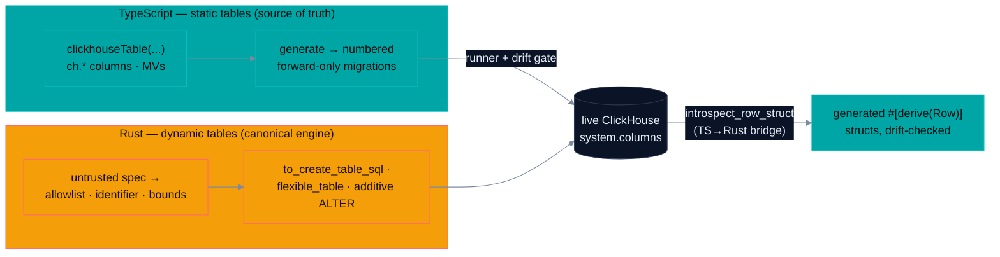

<h1 align="center">clickhouse-kit</h1>

<p align="center">
  <a href="https://smoo.ai"></a>
  <a href="./LICENSE"></a>
  <a href="https://smoo.ai/open-source"></a>
</p>

<p align="center">
  <a href="https://www.npmjs.com/package/@smooai/clickhouse-kit"></a>
  <a href="https://crates.io/crates/smooai-clickhouse-kit"></a>
  <a href="https://docs.rs/smooai-clickhouse-kit"></a>
</p>

<p align="center">
  <a href="https://github.com/SmooAI/clickhouse-kit/actions/workflows/rust.yml"></a>
  <a href="https://github.com/SmooAI/clickhouse-kit/actions/workflows/pr-checks.yml"></a>
</p>

<p align="center">
  <a href="#what-is-this"><b>What it is</b></a> &nbsp;·&nbsp; <a href="#which-language-owns-what"><b>Two languages, one split</b></a> &nbsp;·&nbsp; <a href="#feature-tour"><b>Feature tour</b></a> &nbsp;·&nbsp; <a href="#quickstart"><b>Quickstart</b></a> &nbsp;·&nbsp; <a href="#-part-of-smoo-ai"><b>Platform</b></a>
</p>

---

> **ClickHouse has two schema populations, and they have different natural owners.** Tables a _developer_ authors (observability, metrics, billing) are best written once, in code, with inferred row types — that's the **TypeScript package**. Tables your _customers_ define at runtime (multi-tenant, user-driven shapes) mean turning untrusted input into SQL — that boundary belongs in the process holding the input, so the runtime engine is **canonical in Rust**: an allowlisted type system where SQL injection and unbounded tables are **impossible by construction, not merely discouraged**. Two packages, one deliberate split — and a TS→Rust bridge so the Rust side never hand-copies a TS-owned schema.

## What is this?

A schema toolkit for ClickHouse, shipped as two packages from one repo:

- **[`@smooai/clickhouse-kit`](https://www.npmjs.com/package/@smooai/clickhouse-kit)** (npm, TypeScript) — schema-as-code authoring: `clickhouseTable(...)` → DDL + inferred row type (`InferSelect`) + Zod select/insert schemas, materialized views, forward-only migration _generation_ (numbered files + journal) and a migration runner + drift gate that ride your own ClickHouse client.
- **[`smooai-clickhouse-kit`](https://crates.io/crates/smooai-clickhouse-kit)** (crates.io, Rust — imports as `clickhouse_kit`) — the runtime engine for user-defined / multi-tenant tables (allowlisted types, identifier validation, bounds, `flexible_table`, flatten + coerce, additive evolution), plus the TS→Rust bridge: live-DB introspection → generated `#[derive(Row)]` structs, drift checking, and a driver-agnostic migration runner. Rows stay [Serde](https://serde.rs)-native — the kit never reimplements row mapping.

**Deliberately no WASM/npm binding of the Rust crate** — each language authors in its own kit; the bridge meets at the live database.



## Which language owns what

The honest per-package capability matrix — the split is intentional, not backlog:

| Capability                                                                                        | TS `@smooai/clickhouse-kit`            | Rust `smooai-clickhouse-kit`                                                 |
| ------------------------------------------------------------------------------------------------- | -------------------------------------- | ---------------------------------------------------------------------------- |
| Static schema authoring (`clickhouseTable`, `ch.*`, materialized views, TTL / indexes / settings) | ✅ **source of truth**                 | — (runtime `TableSpec` carries the same DDL clauses, but authoring DX is TS) |
| Inferred row types + Zod select/insert schemas                                                    | ✅ `InferSelect`, `createSelectSchema` | ✅ emits them as generated TS source (`emit_ts_module`)                      |
| Migration file _generation_ (numbered files + journal)                                            | ✅ `generateClickHouseMigrations`      | ❌                                                                           |
| Forward-only migration _runner_ (bring your own client)                                           | ✅ `runClickHouseMigrations`           | ✅ `run_migrations` over the `ChExecutor` trait                              |
| Drift gate (live `system.columns` vs. declared schema)                                            | ✅ `checkClickHouseDrift`              | ✅ `check_drift`                                                             |
| Safety primitives — type allowlist, identifier validation, bounds, reserved columns               | ✅                                     | ✅ **canonical**                                                             |
| Runtime / user-defined tables, `flexibleTable`, flatten + coerce, additive-only evolution         | ✅                                     | ✅ **canonical**                                                             |
| Live-DB introspection → Rust `#[derive(Row)]` structs                                             | ❌                                     | ✅ `introspect_row_struct`                                                   |
| Integration-tested against real ClickHouse (testcontainers) in CI                                 | ❌ (unit tests only)                   | ✅ three integration suites                                                  |

Rule of thumb: **authoring a developer table → TS. Holding untrusted customer input, or in a Rust service → Rust.**

---

## Feature tour

Every snippet is the actual API, verified against the source.

|     | Capability                                                                   | Package |
| --- | ---------------------------------------------------------------------------- | ------- |
| 📐  | [**Schema-as-code authoring**](#-schema-as-code-authoring-ts)                | TS      |
| 🛡️  | [**Untrusted input → safe DDL**](#%EF%B8%8F-untrusted-input--safe-ddl-rust)  | Rust    |
| 🧩  | [**The flexible (hybrid) table**](#-the-flexible-hybrid-table-both)          | both    |
| ⏩  | [**Forward-only migrations + drift**](#-forward-only-migrations--drift-both) | both    |
| 🌉  | [**TS→Rust bridge**](#-tsrust-bridge-rust)                                   | Rust    |

### 📐 Schema-as-code authoring (TS)

Define a table once — DDL, inferred row type, and Zod schemas all come from the same literal. Production clauses (`PARTITION BY`, TTL with volume moves, skip indexes, `SETTINGS`) are first-class options:

```ts
import { ch, clickhouseTable, createSelectSchema, type InferSelect } from "@smooai/clickhouse-kit";

export const events = clickhouseTable(
  "events",
  {
    ts: ch.dateTime64(3),
    org_id: ch.lowCardinality(ch.string()),
    event_id: ch.uuid(),
    value: ch.float64(),
    attributes: ch.mapStringString(),
    ingested_at: ch.dateTime().default("now()"),
  },
  {
    engine: "MergeTree()",
    partitionBy: "(org_id, toDate(ts))",
    orderBy: ["org_id", "ts", "event_id"],
    ttl: {
      column: "ts",
      moveToVolumeAfter: { interval: "14 DAY", volume: "cold" },
      deleteAfter: "90 DAY",
    },
    indexes: [{ name: "idx_name", expr: "name", type: "bloom_filter(0.01)", granularity: 1 }],
    settings: { storage_policy: "hot_cold", index_granularity: 8192 },
  },
);

export type EventRow = InferSelect<typeof events>; // inferred, not hand-written
export const selectEventSchema = createSelectSchema(events); // Zod validator for reads
```

### 🛡️ Untrusted input → safe DDL (Rust)

A column type can come straight from a customer config. The allowlist is an **enum** — disallowed types (`Decimal`, `FixedString`, `Tuple`, arbitrary expressions) have no representation, so they fail to deserialize at the boundary. There is no path from an arbitrary type string to DDL:

```rust
use clickhouse_kit::{to_create_table_sql, ColumnSpec, ColumnTypeSpec, ScalarType, SchemaLimits, TableSpec};

// `{"lowCardinality": "String"}` from untrusted JSON — `Decimal(...)` here would be rejected.
let org_type: ColumnTypeSpec = serde_json::from_str(r#"{"lowCardinality":"String"}"#)?;

let table = TableSpec {
    name: "events".into(),
    columns: vec![
        ColumnSpec { name: "id".into(),  type_spec: ColumnTypeSpec::Scalar(ScalarType::Uuid),       default: None },
        ColumnSpec { name: "org".into(), type_spec: org_type,                                       default: None },
        ColumnSpec { name: "ts".into(),  type_spec: ColumnTypeSpec::Scalar(ScalarType::DateTime64), default: None },
    ],
    engine: "MergeTree()".into(),
    order_by: vec!["id".into()],
    partition_by: None,
    ttl: None,
    indexes: vec![],
    settings: vec![],
};

let ddl = to_create_table_sql(&table, &SchemaLimits::default())?;
```

Every identifier is validated (`^[A-Za-z_][A-Za-z0-9_]*$` + length bound, backtick-quoted on render), column counts are bounded, and `ORDER BY` entries must be real columns.

### 🧩 The flexible (hybrid) table (both)

The most-reused multi-tenant shape in one call — mandatory + promoted typed columns, plus an `attrs Map(String, String)` catch-all and a `raw String` — with `flatten_record` / `coerce_to_table` (TS: `flattenRecord` / `coerceToTable`) to shape arbitrary records into it, and `diff_columns` + `alter_add_columns_sql` for **additive-only** evolution:

```rust
use clickhouse_kit::{flexible_table, coerce_to_table, FlexibleConfig, FlattenOptions, SchemaLimits};

let table = flexible_table("customer_events", config, &SchemaLimits::default())?;
let shaped = coerce_to_table(input_json, &table, &FlattenOptions::default());
// shaped.row → ready to insert · shaped.overflow_keys → what routed into `attrs`
```

### ⏩ Forward-only migrations + drift (both)

No auto-diff engine — schema changes are explicit numbered migrations, tracked in `_ch_migrations`, applied forward-only. TS _generates_ the files (`generateClickHouseMigrations` + a journal); both sides _run_ them and both gate drift against live `system.columns`. The I/O layer is a tiny trait/interface, so neither package pins your ClickHouse driver:

```rust
use clickhouse_kit::{run_migrations, check_drift};

let applied = run_migrations(&exec, std::path::Path::new("clickhouse/migrations")).await?;
let drift = check_drift(&exec, &[table]).await?;   // live schema vs. your TableSpecs
```

### 🌉 TS→Rust bridge (Rust)

When TypeScript owns a table's schema, the Rust side never hand-copies the row struct — it introspects the live table and generates it, with `check_drift` in CI asserting the generated view stays ≡ the live schema:

```rust
use clickhouse_kit::introspect_row_struct;

let src = introspect_row_struct(&exec, "events", "EventRow").await?;
// → #[derive(Debug, Clone, clickhouse::Row, serde::Serialize, serde::Deserialize)]
//   pub struct EventRow { pub id: String, /* UUID */ pub org: String, /* LowCardinality(String) */ … }
```

Codegen runs the other direction too: `emit_row_interface` / `emit_select_schema` / `emit_insert_schema` / `emit_ts_module` turn a Rust `TableSpec` into a TS interface + Zod schemas.

---

## Quickstart

Both packages are published — these install lines were verified against the live registries:

**TypeScript** (npm, currently `0.2.0`):

```bash
pnpm add @smooai/clickhouse-kit zod   # zod ^4 is a peer dependency
```

**Rust** (crates.io, currently `0.3.0` — the crate is `smooai-clickhouse-kit`, it imports as `clickhouse_kit`):

```toml
[dependencies]
smooai-clickhouse-kit = "0.3"
```

```rust
use clickhouse_kit::{to_create_table_sql, TableSpec};
```

Full Rust walkthrough (every runtime primitive, with the safety posture spelled out): [`crates/clickhouse-kit/README.md`](crates/clickhouse-kit/README.md). The v0.2 reframe and the source-of-truth model: [`ROADMAP.md`](ROADMAP.md).

## Design invariants

- **Safe by construction.** Every runtime/user-facing primitive validates input; the happy path makes SQL injection and unbounded tables impossible, not discouraged.
- **Forward-only.** No auto-diff engine for code-defined tables; the additive `ALTER` path for dynamic per-tenant tables is a separate, explicitly-bounded path.
- **Rows are Serde-native / Zod-native.** Reads use `#[derive(clickhouse::Row)]` in Rust and Zod schemas in TS — the kit doesn't reinvent row mapping.
- **Bring your own client.** `ChExecutor` (Rust) / `ClickHouseClient` (TS) are minimal interfaces; the kit never pins a driver.
- **Tested against real ClickHouse.** The Rust migration runner, drift gate, DDL round-trip, and introspection→codegen path run against real ClickHouse via testcontainers in CI.

## CI + publishing

- **TypeScript** — `pr-checks.yml` on every PR: typecheck → lint → format check → test → build. Publishing via changesets (`release.yml`).
- **Rust** — `rust.yml` on PRs + main: `cargo fmt --check` → `clippy --all-targets -D warnings` → unit tests → testcontainers integration against real ClickHouse. Crate publishing is a manual `publish-crate.yml` dispatch after a version bump.

## 🧩 Part of Smoo AI

clickhouse-kit is built and open-sourced by **[Smoo AI](https://smoo.ai)** — the AI-powered business platform with AI built into every product: CRM, customer support, campaigns, field service, observability, and developer tools.

- 🧰 **More open source from Smoo AI** — [smoo.ai/open-source](https://smoo.ai/open-source)
- 🧩 **Sibling packages** — [@smooai/logger](https://github.com/SmooAI/logger), [@smooai/utils](https://github.com/SmooAI/utils), [@smooai/fetch](https://github.com/SmooAI/fetch), [smooth](https://github.com/SmooAI/smooth) (the `th` CLI)

## 🤝 Contributing

PRs welcome. TS changes need `pnpm check-all` green and a changeset; Rust changes need `cargo fmt`, clippy-clean `--all-targets`, and tests (the integration suite needs Docker for testcontainers). Keep the invariants above — especially safe-by-construction on anything reachable from untrusted input.

## 📄 License

MIT © [SmooAI](https://smoo.ai). See [LICENSE](./LICENSE).

---

<p align="center">
  Built by <a href="https://smoo.ai"><strong>Smoo AI</strong></a> — AI built into every product.
</p>
